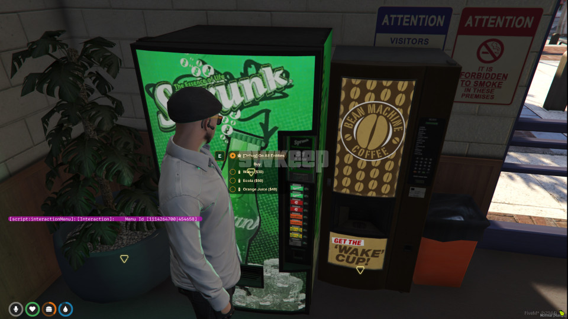
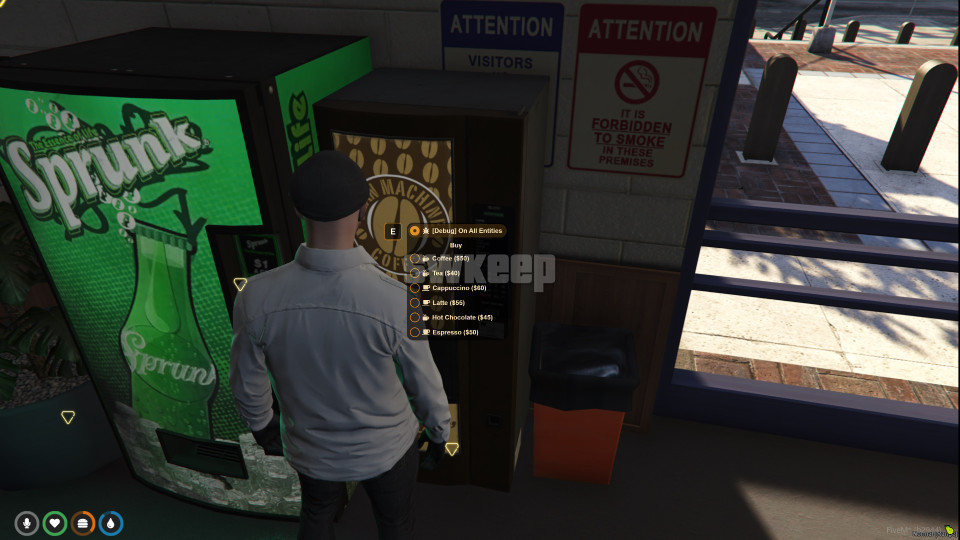
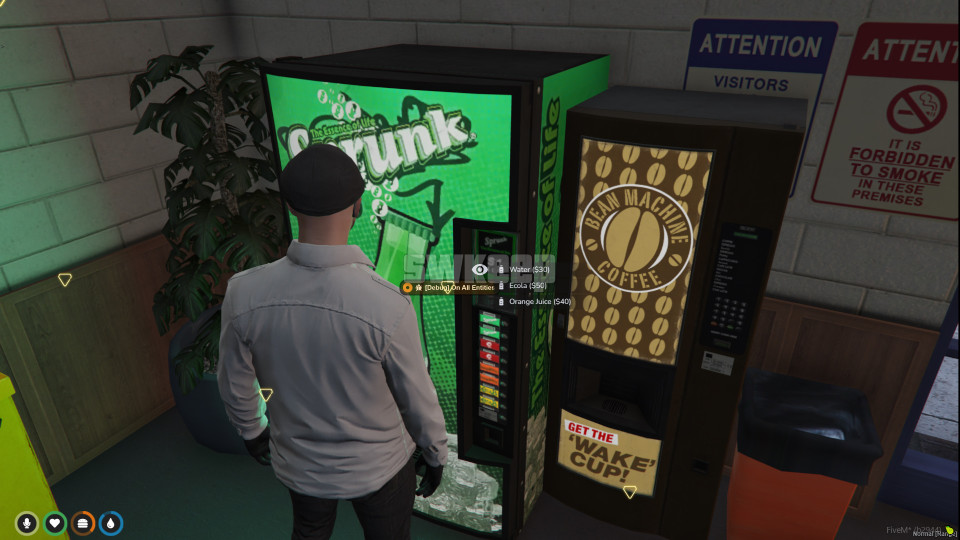

|  |  |  |
|-------------------------------------------------------|--------------------------------------------------------|------------------------------------------|

# Vending Machine Script

This FiveM script enables players to interact with vending machines using the interaction menu.
You can download the interaction menu from [**here**](https://github.com/swkeep/interaction-menu).

The script is compatible with qb-core and qb-hud, but it can be easily adapted for other frameworks, HUDs, and target scripts due to its simplicity.

## Features

- Fully functional vending machines
- Compatible with `interactionMenu` / `ox_target` / `qb-target`
- Server-side money and item management

## Installation

Installation is straightforward. Ensure you have the interaction menu installed and place this script after its dependencies in your `server.cfg` file:

```lua
ensure interactionRenderer
ensure interactionDUI
ensure interactionMenu

ensure [qb]
ensure keep-vendingMachines
```
